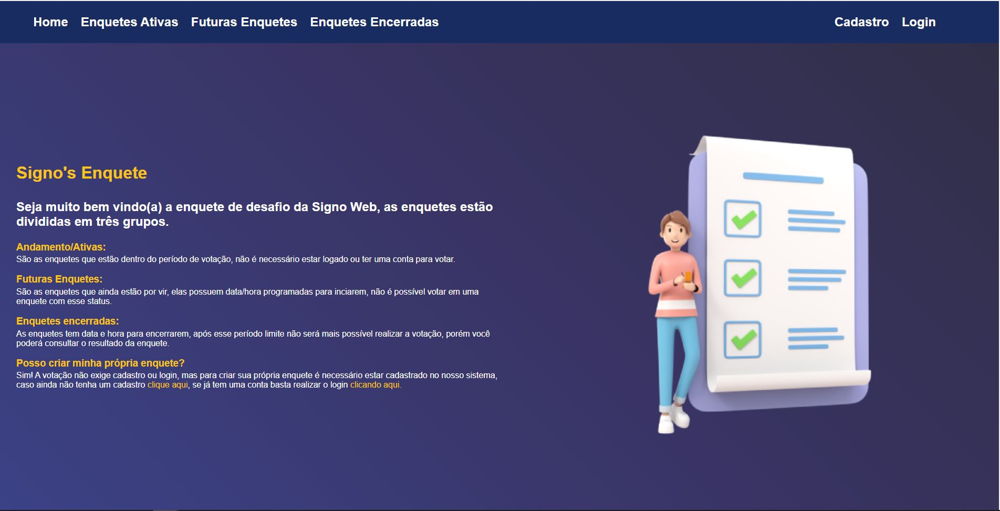
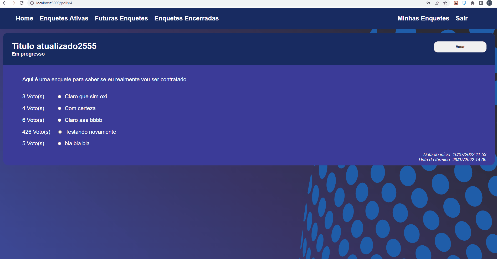
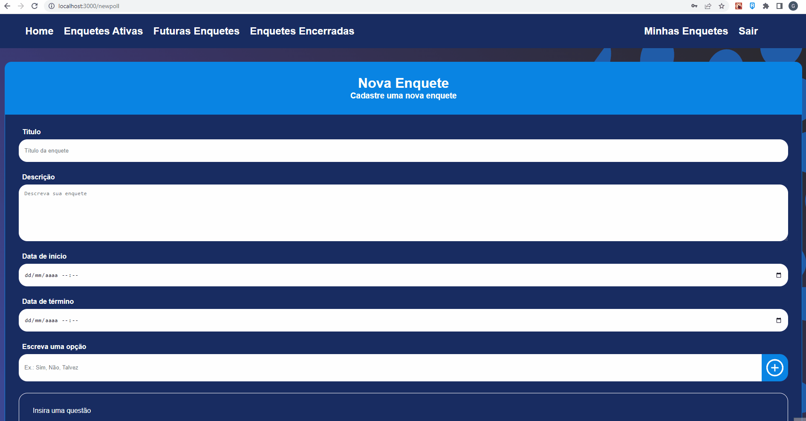

# Sistema de votação
## Desafio Signo Web

### Sobre o sistema
Sistema de votação desenvolvido para o desafio para uma vaga de DEV na empresa Signo Web, o sistema conta com um backend desenvolvido em Node/express utilizando o banco de dados MySql com sequelize. O frontend foi desenvolvido com ReactJS com redux e react-router-dom. 

A votação pode ser feita sem ter um usuário cadastrado, porém para criar as suas próprias enquetes é preciso ter uma conta e estar logado. O sistema conta com um CRUD completo e o resultado da enquete é atualizado em tempo real a cada votação. O sistema de login conta com autenticação utlizando o JsonWebToken.

## Veja algumas imagens abaixo e em seguida o  tutorial de instalação
 
 

 

 

 
 
 

## Instalação do Back-End

Renomeie o arquivo `.env-copy` para `.env` e em seguida preencha-o com as informações necessárias para a conexão com o banco de dados MySql, também será necessário preencher o JWT_SECRET com uma palavra de segurança.

No prompt de comando navegue até a pasta do backend e execute o comando `npm i` aguarde até o final da instalação das dependências.

Para executar o backend digite o comando `npm run server` as tabelas serão criadas automaticamente no banco de dados. 

OBS: Lembre-se de criar um banco de dados previamente!

A versão do Node utilizada foi a `16.15.0`

## Instalação do front-end

No prompt de comando navegue até a pasta frontend, em seguida digite o comando `npm i` e aguarde a instalação das depedências.

Para executar o projeto, basta digitar o comando `npm start`

Pronto, agora seu sistema já está prontinho para ser utlizado, faça um cadastro de usuário e comece a criar suas enquetes.